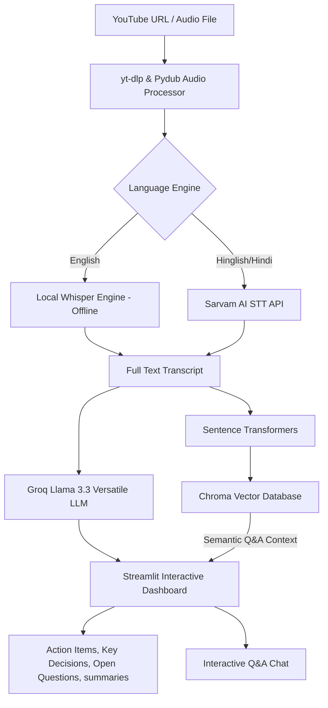

# 🎬 AI Video Assistant

An advanced, premium AI-powered meeting intelligence and video analysis dashboard. It downloads, transcribes, translates, indexes, and extracts rich summaries, action items, and key decisions from any YouTube video or audio file. It also supports an interactive RAG (Retrieval-Augmented Generation) chat system allowing you to talk directly with the video context!

Developed with a gorgeous, dark-themed custom UI built on **Streamlit** and optimized with a blazingly fast, **100% free** open-source LLM backbone.

---

## ✨ Key Features

* **🎥 Video Acquisition**: Instantly downloads and processes audio from any YouTube URL (via `yt-dlp` and `pydub`).
* **🗣️ Multi-Language Transcription**:
  * **English**: Runs a **100% local and offline** Whisper model on your machine for complete data privacy.
  * **Hindi / Hinglish**: Directly translates spoken Hindi or Hinglish speech into polished English text using the high-fidelity **Sarvam AI STT** translation API.
* **⚡ Ultra-Fast Meeting Intelligence**: Powered by Meta's state-of-the-art **`llama-3.3-70b-versatile`** model hosted on **Groq Cloud** for instant, high-reasoning meeting summaries, action items, and decisions completely for free.
* **🧠 Retrieval-Augmented Generation (RAG)**: Integrates a local **Chroma vector database** paired with `all-MiniLM-L6-v2` sentence-transformer embeddings to allow semantic-search-driven Q&A with the video.
* **🎨 Premium Cyberpunk UI**: Features animated grid backgrounds, sleek glassmorphism, custom typography (Syne & JetBrains Mono), responsive sidebar tabs, status indicators, and one-click PDF reports.

---

## 🏗️ System Architecture



---

## 🛠️ Prerequisites

1. **Python 3.10 or higher** installed on your system.
2. **FFmpeg** binary must be installed and added to your system's PATH variables (required for audio extraction and chunking).

---

## ⚙️ Installation & Setup

### 1. Clone the Repository
```bash
git clone https://github.com/YOUR_USERNAME/AI-Video-Assistant.git
cd AI-Video-Assistant
```

### 2. Set Up a Virtual Environment
Create and activate a local Python virtual environment:
```bash
# Windows
python -m venv venv
.\venv\Scripts\activate

# macOS / Linux
python3 -m venv venv
source venv/bin/activate
```

### 3. Install Dependencies
Install all required packages from `Requirements.txt` as well as the Groq connector and sentence transformers:
```bash
pip install -r Requirements.txt
pip install langchain-groq sentence-transformers
```

### 4. Configure Environment Variables
Create a file named `.env` in the root directory of your project and configure it with your API keys:

```env
# Get your free Groq API key from: https://console.groq.com/keys
GROQ_API_KEY=gsk_your_groq_key_here

# Get your Sarvam API key from: https://www.sarvam.ai/ (Only required if using Hinglish engine)
SARVAM_API_KEY=your_sarvam_key_here

# Local Whisper model: tiny, base, small, medium, large (small recommended)
WHISPER_MODEL=small

# Sarvam STT Translation model
SARVAM_STT_MODEL=saaras:v2.5
```

---

## 🚀 How to Run

Launch the Streamlit web dashboard:
```bash
streamlit run app.py
```

Once running, open your browser and navigate to the local URL (usually **`http://localhost:8501`**).

---

## 📝 Usage Guide
1. **Enter Video Link**: Paste any valid YouTube URL into the input field in the sidebar.
2. **Select Language Engine**: Select **English** (local Whisper model) or **Hinglish** (Sarvam AI translation).
3. **Analyse**: Click **⚡ ANALYSE** to start the pipeline.
4. **Browse Tabs**: Read through **Summary**, **Action Items**, **Key Decisions**, and **Unresolved Questions** generated in real-time.
5. **Talk with the Video**: Use the chat container at the bottom to ask the system specific questions about what was discussed in the video.

---

## 🛡️ License

This project is open-source and licensed under the [MIT License](LICENSE).
